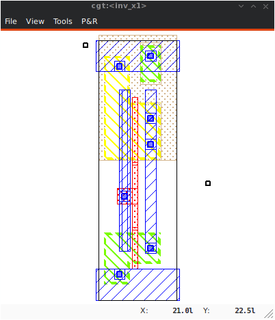
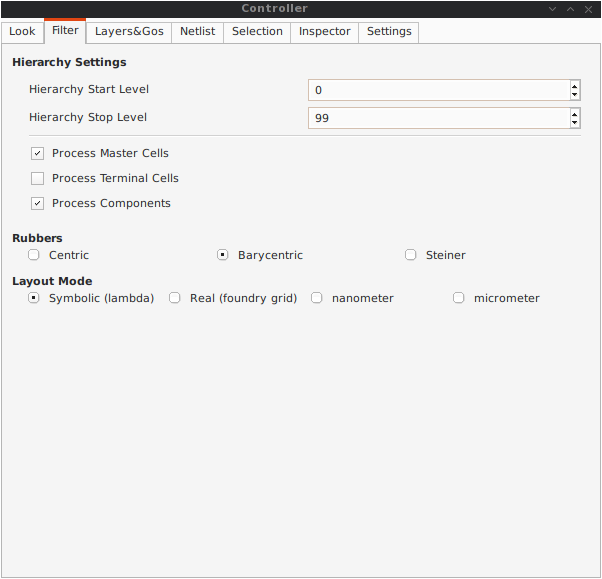
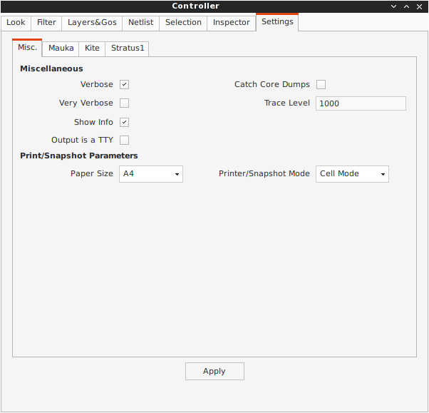

.. -*- Mode: rst -*-

.. include:: ../../../etc/definitions.rst

.. role:: raw-html(raw)
   :format: html

.. URLs that changes between the various backends.
.. _Coriolis Tools Documentation:   http://coriolis.lip6.fr/
.. _Stratus Documentation:          http://coriolis.lip6.fr/pages/stratus-language.html
.. _Here:                           ../../images/users-guide/UsersGuide.pdf
.. _Coriolis User's Guide:          ../../images/users-guide/UsersGuide.pdf

.. For PDF backend
.. |BigMouse|                       image:: ./images/ComputerMouse.png
                                    :width: 30%

.. |ControllerSnapshot_1|           image:: ./images/Controller-1.png
                                    :alt:   Controller Basic Snapshot
                                    :align: middle
                                    :width: 80%

.. |ControllerLook_1|               image:: ./images/Controller-Look-1.png
                                    :alt:   Controller Look, Snapshot 1
                                    :align: middle
                                    :width: 80%

.. |ControllerLayersGos_1|          image:: ./images/Controller-LayersGos-1.png
                                    :alt:   Controller Basic Snapshot
                                    :align: middle
                                    :width: 80%

.. |ControllerNetlist_1|            image:: ./images/Controller-Netlist-1.png
                                    :alt:   Controller Basic Snapshot
                                    :align: middle
                                    :width: 80%

.. |ViewerNetlist_1|                image:: ./images/Viewer-Netlist-1.png
                                    :alt:   Controller Basic Snapshot
                                    :align: middle
                                    :width: 80%

.. |ControllerSelection_1|          image:: ./images/Controller-Selection-1.png
                                    :alt:   Controller Basic Snapshot
                                    :align: middle
                                    :width: 80%

.. |ControllerInspector_1|          image:: ./images/Controller-Inspector-1.png
                                    :alt:   Controller Basic Snapshot
                                    :align: middle
                                    :width: 80%

.. |ControllerInspector_2|          image:: ./images/Controller-Inspector-2.png
                                    :alt:   Controller Basic Snapshot
                                    :align: middle
                                    :width: 80%

.. |ControllerInspector_3|          image:: ./images/Controller-Inspector-3.png
                                    :alt:   Controller Basic Snapshot
                                    :align: middle
                                    :width: 80%

.. |Etesian-1|                      image:: ./images/etesian-1.png
                                    :alt:   Etesian Abutment Box
                                    :align: middle
                                    :width: 80%

.. |ChipStructure-1|                image:: ./images/chip-structure-1.png
                                    :alt:   Chip Top Structure
                                    :align: middle

.. raw:: latex

  \newpage

  \pagestyle{empty} 

  \begin{center}

    \hfill \includegraphics[height=2.0cm]{../../../etc/images/Logo-LIP6-bleugris}
    \hfill \includegraphics[height=1.8cm]{../../../etc/images/Logo-SU}
    \hfill \includegraphics[height=2.0cm]{../../../etc/images/Logo-CNRS}
    \hfill
    \\*[2cm]

    \huge \textsc{Sorbonne Université} \\*[1cm]
  
    \huge {\textsc{lip6} Laboratory} \\*[3cm]

    \Huge \textbf{\textsc{Coriolis}} \\*[1cm]
    \Huge \textbf{User's Guide}      \\*[1cm]

    \huge {Jean-Paul \textsc{Chaput}} \\
    \Large\href{mailto:Jean-Paul.Chaput@lip6.fr}{Jean-Paul.Chaput@lip6.fr}\\*[4cm]

    \includegraphics[scale=1.0]{../../../etc/images/logoCC.pdf}

    \normalsize
    This work is licensed under a \\
    Creative Commons Attribution-NonCommercial-ShareALike 4.0 International License. \\
    Creative Commons License \href{https://creativecommons.org/licenses/by-nc-sa/4.0/}{creativecommons.org/licenses/by-nc-sa/4.0/}

  \end{center}

  \newpage
  \pagestyle{fancy} 

|pagestylefancy|

.. contents::

|newpage|

.. include:: Abstract.rst
.. include:: LicenseCredits.rst
.. include:: DesignFlow.rst
.. include:: Installation.rst
.. include:: ViewerTools.rst
.. .. include:: ScriptsPlugins.rst
